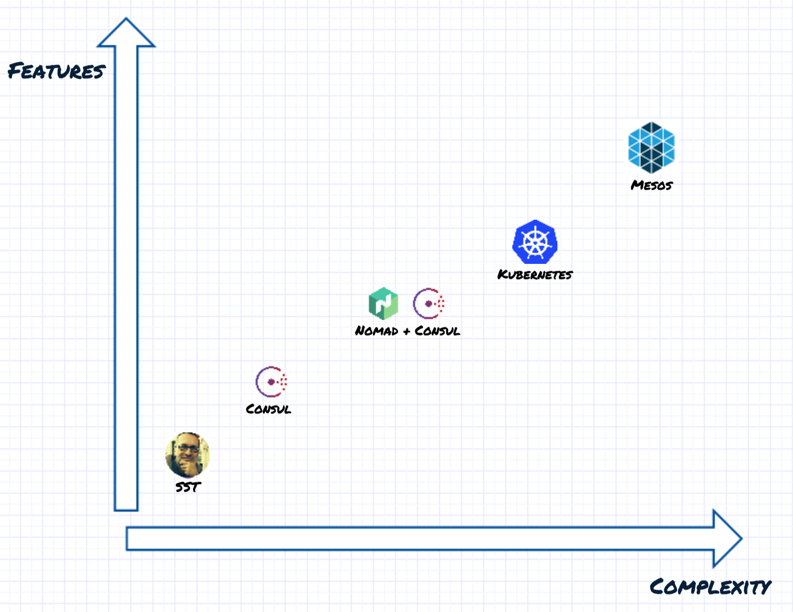

### Intro

<!-- .slide: data-background="img/background-orange-orig.jpg" -->

1. *What is the problem?*
2. What solutions are there?

---

### What is the problem?

- Single source of truth
- Resource utilization
- Load Balancer management

---

### What solutions are there?


---

### A table

<table>
    <thead>
        <tr>
            <th>Item</th>
            <th>Amount</th>
            <th>Price</th>
        </tr>
    </thead>
    <tbody>
        <tr>
            <td>Computer</td>
            <td>3</td>
            <td>100 €</td>
        </tr>
        <tr>
            <td>Book</td>
            <td>&gt;20</td>
            <td>4.31 €</td>
        </tr>
    </tr></tbody>
</table>

---

### Source code

```
 class LengthComparator implements Comparator<String> {
   public int compare(String first, String second) {
     return Integer.compare(first.length(), second.length());
   }
 }
```

---

### Another slide

Lorem ipsum
